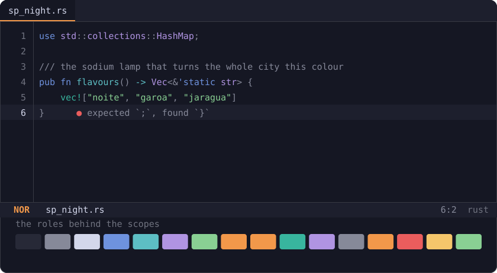
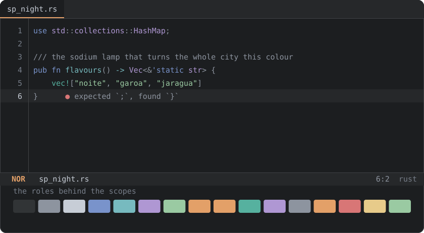
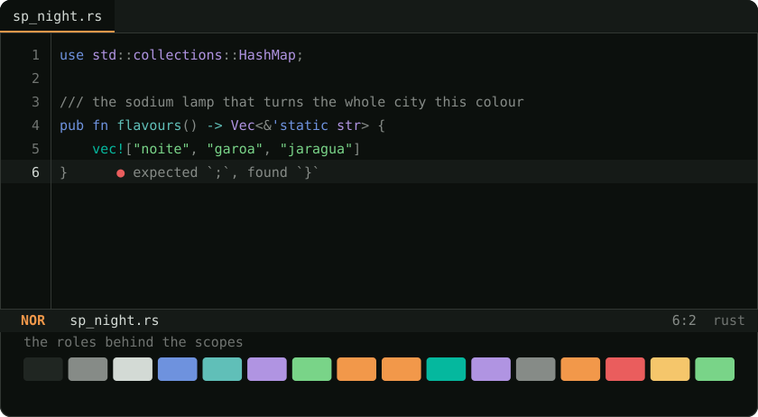

<p align="center">
  <a href="https://sp-night.github.io">
    
  </a>
</p>

<h1 align="center">SP Night for <a href="https://helix-editor.com/">Helix</a></h1>

<p align="center">
  <strong>The sodium lamp turns the whole city this colour.</strong><br>
  A dark colour scheme with São Paulo as its reference — the sodium street lamp,<br>
  exposed concrete, the free span of the MASP, the drizzle before the rain.
</p>

<p align="center">
  <a href="https://sp-night.github.io"><strong>sp-night.github.io</strong></a>
  &nbsp;·&nbsp;
  <a href="https://sp-night.github.io/palette">palette</a>
  &nbsp;·&nbsp;
  <a href="https://sp-night.github.io/spec">spec</a>
  &nbsp;·&nbsp;
  <a href="https://sp-night.github.io/ports">ports</a>
</p>

---

## The flavours

All three are dark, by decision. The previews below are synthetic — drawn from the
palette itself, so they can never drift from what you install.

### Noite Paulista — `sp_night_noite.toml`

The city at 3am. Blue-violet dark, the sodium lamp burning warm on top.



### Garoa — `sp_night_garoa.toml`

The same window, seen through the drizzle. Flat grey — the garoa does not cool
the city down, it washes it out.



### Pico do Jaraguá — `sp_night_jaragua.toml`

The same night, seen from the city's highest point. Near-black surfaces, with
the forest left to the accents — and the red-and-white tower lit at the summit.



## Install

Helix resolves `theme = "<name>"` against `~/.config/helix/themes/` by file
name, so the file goes there and the name in your config is the file's stem.

Grab the flavour you want (or all three):

```sh
mkdir -p ~/.config/helix/themes
curl -Lo ~/.config/helix/themes/sp_night_noite.toml \
  https://raw.githubusercontent.com/sp-night/helix/main/themes/sp_night_noite.toml
```

Then set it in `~/.config/helix/config.toml`:

```toml
theme = "sp_night_noite"
```

Reload with `:config-reload`, or try one without committing to it using
`:theme sp_night_noite`.

> [!NOTE]
> `default` and `base16_default` are names Helix reserves, which is why
> every flavour here is prefixed `sp_night_`.

Prefer a checkout? Clone and copy — the files are plain text, there is no build:

```sh
git clone https://github.com/sp-night/helix.git
cp helix/themes/*.toml ~/.config/helix/themes/
```

## What gets themed

| Helix key | Role | Meaning |
|---|---|---|
| `ui.background` / `ui.text` | `ui.bg` / `ui.fg` | *laje* under the main text |
| `ui.cursor.primary` / `ui.cursor` | `ui.cursor` / `ui.fg_dim` | the *sódio* cursor, and every secondary one dimmed so the primary is findable |
| `ui.cursor.normal` / `.insert` / `.select` | `ui.cursor` / `diagnostic.ok` / `ui.accent_alt` | the mode changes hue, not brightness — the one thing a modal editor must never leave ambiguous |
| `ui.statusline` / `.inactive` | `ui.panel` / `ui.bg_deep` | the focused bar on exposed concrete, the rest receding into the *vão* |
| `ui.selection` / `.primary` | `ui.selection` | *vidro*, glass reflecting the street |
| `ui.linenr` / `.selected` | `ui.fg_muted` / `ui.fg` | the gutter recedes, the line you are on does not |
| `ui.virtual.indent-guide` / `.ruler` / `.whitespace` | `ui.border` / `ui.line` / `ui.fg_muted` | *fiação*, overhead wiring — structure you see past, not at |
| `ui.virtual.inlay-hint` | `ui.fg_muted` | the editor's own annotations stay quieter than anything you typed |
| `keyword` / `function` / `type` / `string` | `syntax.*` | the same accents every SP Night port gives these |
| `diagnostic.error` / `.warning` / `.info` / `.hint` | `diagnostic.*` | undercurled in *brasa*, *táxi*, *marginal*, *sereno* |
| `diff.plus` / `.minus` / `.delta` | `git.added` / `git.removed` / `git.modified` | the gutter reads like the rest of the toolchain does |
| `markup.heading.1…6` / `markup.link.url` | `ui.accent` / `ui.link` | Markdown headings in *sódio*, links in *marginal* — the expressway sign |

No hex in this repo was picked by hand. Every value comes from the
[SP Night palette](https://sp-night.github.io/palette) through its role layer,
both published as data:
[`palette.json`](https://sp-night.github.io/palette.json) and
[`roles.json`](https://sp-night.github.io/roles.json). The contrast floors those
colours have to clear are [written down in the spec](https://sp-night.github.io/spec)
and enforced in CI.

## The mapping

[`helix.toml.tmpl`](helix.toml.tmpl) is the full record of which Helix key means which
role — the table above in complete form. The files in
[`themes/`](themes) are what it resolves to, one per flavour.

You never need it to use the theme: the shipped files are plain text and final.
It is here so the mapping survives, and so a retuned palette can be rolled
through this port without anyone re-deciding what a mode colour means.

## License

[MIT](LICENSE)
